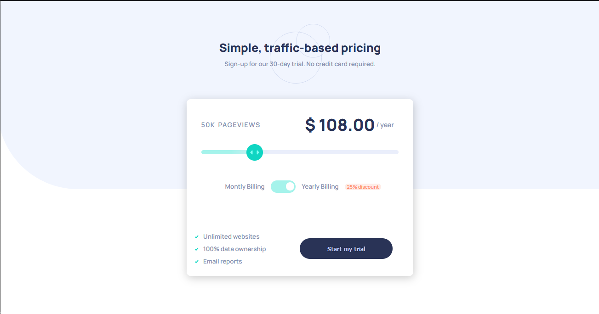
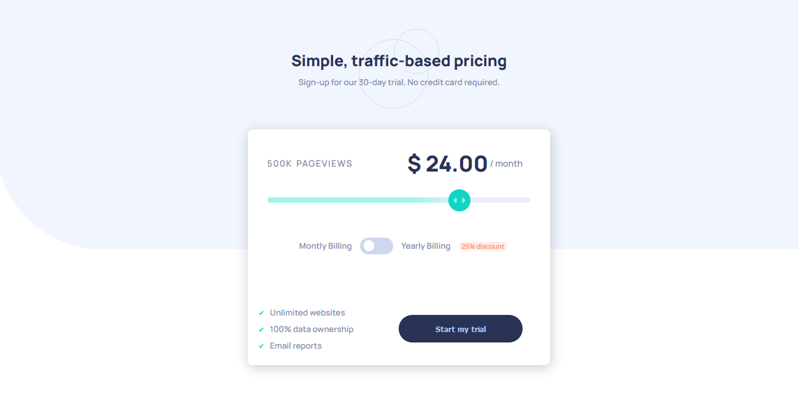

# Frontend Mentor - Interactive pricing component solution

This is a solution to the [Interactive pricing component challenge on Frontend Mentor](https://www.frontendmentor.io/challenges/interactive-pricing-component-t0m8PIyY8). Frontend Mentor challenges help you improve your coding skills by building realistic projects.

## Table of contents

- [Overview](#overview)
  - [The challenge](#the-challenge)
  - [Screenshot](#screenshot)
  - [Links](#links)
- [My process](#my-process)
  - [Built with](#built-with)
  - [What I learned](#what-i-learned)
  - [Continued development](#continued-development)
  - [Useful resources](#useful-resources)
- [Author](#author)

**Note: Delete this note and update the table of contents based on what sections you keep.**

## Overview

### The challenge

Users should be able to:

- View the optimal layout for the app depending on their device's screen size
- See hover states for all interactive elements on the page
- Use the slider and toggle to see prices for different page view numbers

### Screenshot

### Links

- Solution URL: [Add solution URL here](https://your-solution-url.com)
- Live Site URL: [Add live site URL here](https://your-live-site-url.com)

### Built with

- Semantic HTML5 markup
- Flexbox
- CSS Grid

### What I learned

I learned css grid in practice

### Continued development

I want to focus more on learning css grid better in future, and practice creating some custom range slider more.

### Useful resources

- [resource 1](https://www.youtube.com/watch?v=zf_LclaxIHk) - This helped me in creating custom range slider.
- [resource 2](https://www.youtube.com/watch?v=N8BZvfRD_eU) - This helped me in uderstandin how to create custom css toggle inputs
- [resource 3](https://developer.mozilla.org/en-US/docs/Web/CSS/CSS_grid_layout/Basic_concepts_of_grid_layout) - Helped to understand how css grid works better.

## Author

- Frontend Mentor - [@AliceFoxx](https://www.frontendmentor.io/profile/AliceFoxx)
